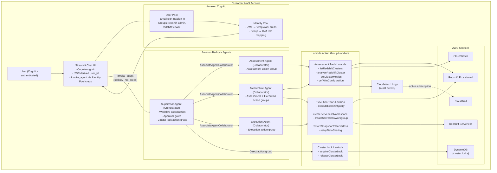
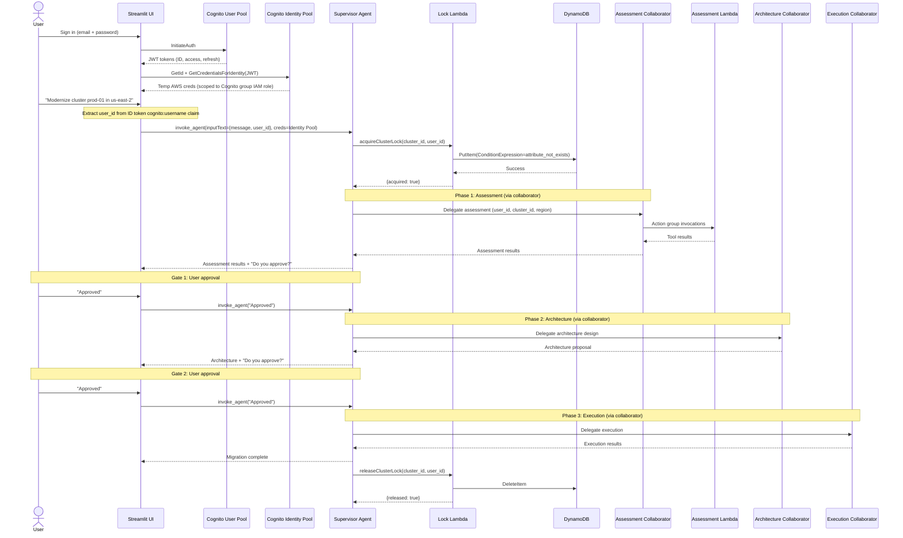
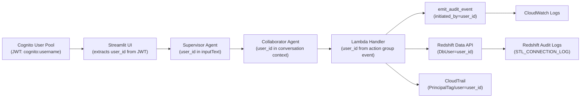
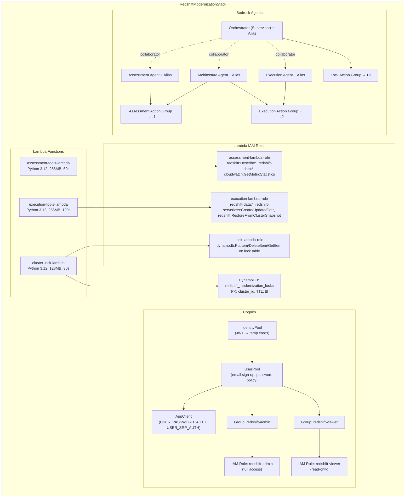
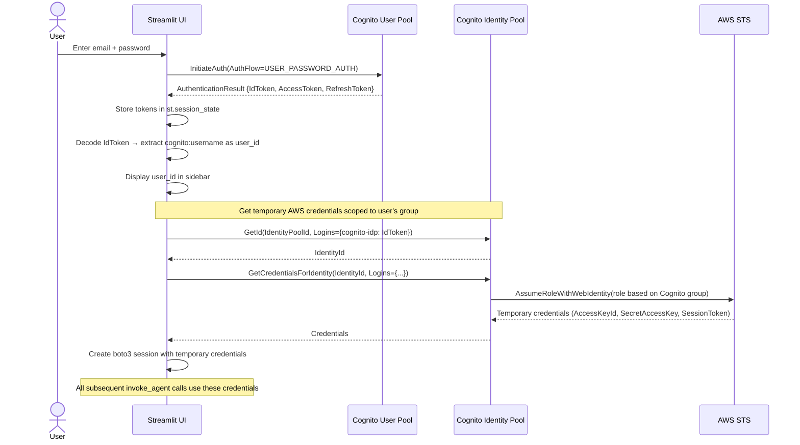

# Design: Bedrock Agents Rewrite

## Overview

This design rewrites the Redshift Modernization Agents system from Strands Agents + Bedrock AgentCore to fully managed Amazon Bedrock Agents. The core migration logic (9 tool functions, audit logger, cluster lock, data models) is preserved. The architectural change is:

- Each `@tool` function becomes a plain Python function inside a Lambda handler that receives Bedrock Agent action group invocation events.
- Each subagent (assessment, architecture, execution) becomes a Bedrock Agent resource with action groups pointing to Lambda functions.
- The orchestrator becomes a Bedrock supervisor agent using `AssociateAgentCollaborator` for native multi-agent collaboration.
- The cluster lock action group is wired directly on the supervisor (not via a collaborator).
- Cognito User Pool + Identity Pool replace the manual `user_id` text input for authentication and authorization.
- Cognito groups (`redshift-admin`, `redshift-viewer`) map to IAM roles for least-privilege authorization.
- All infrastructure is provisioned via AWS CDK.

The three-phase workflow (assessment → architecture → execution), approval gates, cluster locking, identity propagation chain, audit logging, and data models are all preserved unchanged.

## Architecture



### Workflow Sequence



### Identity Propagation Chain



## Components and Interfaces

### 1. Lambda Handler Pattern

Each Lambda handler receives Bedrock Agent action group invocation events and dispatches to the appropriate tool function. The handler pattern replaces the Strands `@tool` decorator:

```python
# lambda_handler.py pattern
import json
from audit_logger import emit_audit_event

def handler(event, context):
    """Bedrock Agent action group Lambda handler."""
    agent = event.get("agent", {})
    action_group = event.get("actionGroup", "")
    api_path = event.get("apiPath", "")
    http_method = event.get("httpMethod", "")
    parameters = {p["name"]: p["value"] for p in event.get("parameters", [])}
    request_body = event.get("requestBody", {})
    session_attributes = event.get("sessionAttributes", {})
    
    # Dispatch to tool function based on apiPath
    if api_path == "/listRedshiftClusters":
        result = list_redshift_clusters(**parameters)
    elif api_path == "/analyzeRedshiftCluster":
        result = analyze_redshift_cluster(**parameters)
    # ... etc
    
    # Return Bedrock Agent action group response format
    return {
        "messageVersion": "1.0",
        "response": {
            "actionGroup": action_group,
            "apiPath": api_path,
            "httpMethod": http_method,
            "httpStatusCode": 200,
            "responseBody": {
                "application/json": {
                    "body": json.dumps(result)
                }
            }
        }
    }
```

Key design decisions:
- Tool logic is extracted from `@tool` functions into plain Python functions — same boto3 calls, same error handling (`{"error": ...}` dicts), same parameter defaults.
- `audit_logger.py` and `models.py` are bundled in each Lambda deployment package.
- `user_id` is extracted from the action group event parameters and propagated to `emit_audit_event(initiated_by=user_id)` and `DbUser=user_id`.
- Errors from boto3 calls are caught and returned as structured error responses, never raised.

### 2. Lambda Function Groupings

Three Lambda functions, each handling a logical group of tools:

| Lambda Function | Tools | Shared With Agents |
|---|---|---|
| `assessment-tools` | `listRedshiftClusters`, `analyzeRedshiftCluster`, `getClusterMetrics`, `getWlmConfiguration` | Assessment Agent, Architecture Agent |
| `execution-tools` | `executeRedshiftQuery`, `createServerlessNamespace`, `createServerlessWorkgroup`, `restoreSnapshotToServerless`, `setupDataSharing` | Architecture Agent, Execution Agent |
| `cluster-lock` | `acquireClusterLock`, `releaseClusterLock` | Orchestrator (direct action group) |

Each Lambda bundles: tool logic (plain functions), `audit_logger.py`, `models.py`, `cluster_lock.py` (lock Lambda only).

### 3. OpenAPI Schemas

Each action group is defined by an OpenAPI 3.0 schema. The schemas describe operations, parameters, and response formats so Bedrock Agents know how to invoke the Lambda handlers.

**Assessment Action Group Schema** (`assessment-tools-openapi.json`):

```yaml
openapi: "3.0.0"
info:
  title: "Assessment Tools"
  version: "1.0.0"
paths:
  /listRedshiftClusters:
    get:
      operationId: listRedshiftClusters
      summary: List all Redshift clusters in a region
      parameters:
        - name: region
          in: query
          required: false
          schema: { type: string, default: "us-east-1" }
          description: "AWS region (default: us-east-1)"
        - name: user_id
          in: query
          required: true
          schema: { type: string }
      responses:
        "200":
          description: List of clusters or error
          content:
            application/json:
              schema:
                oneOf:
                  - type: array
                    items: { type: object }
                  - type: object
                    properties:
                      error: { type: string }
  /analyzeRedshiftCluster:
    get:
      operationId: analyzeRedshiftCluster
      summary: Analyze Redshift cluster configuration
      parameters:
        - name: cluster_id
          in: query
          required: true
          schema: { type: string }
        - name: region
          in: query
          required: false
          schema: { type: string, default: "us-east-1" }
        - name: user_id
          in: query
          required: true
          schema: { type: string }
      responses:
        "200":
          description: Cluster configuration or error
  /getClusterMetrics:
    get:
      operationId: getClusterMetrics
      summary: Get CloudWatch metrics for a Redshift cluster
      parameters:
        - name: cluster_id
          in: query
          required: true
          schema: { type: string }
        - name: region
          in: query
          required: false
          schema: { type: string, default: "us-east-1" }
        - name: hours
          in: query
          required: false
          schema: { type: integer, default: 24 }
          description: "Hours of historical data (default: 24)"
        - name: user_id
          in: query
          required: true
          schema: { type: string }
      responses:
        "200":
          description: CloudWatch metrics or error
  /getWlmConfiguration:
    get:
      operationId: getWlmConfiguration
      summary: Query WLM configuration and per-queue metrics
      parameters:
        - name: cluster_id
          in: query
          required: true
          schema: { type: string }
        - name: region
          in: query
          required: false
          schema: { type: string, default: "us-east-1" }
        - name: user_id
          in: query
          required: true
          schema: { type: string }
      responses:
        "200":
          description: WLM queue metrics or error
```

**Execution Action Group Schema** (`execution-tools-openapi.json`):

```yaml
openapi: "3.0.0"
info:
  title: "Execution Tools"
  version: "1.0.0"
paths:
  /executeRedshiftQuery:
    post:
      operationId: executeRedshiftQuery
      summary: Execute SQL query via Redshift Data API
      parameters:
        - name: cluster_id
          in: query
          required: true
          schema: { type: string }
        - name: query
          in: query
          required: true
          schema: { type: string }
        - name: region
          in: query
          required: false
          schema: { type: string, default: "us-east-1" }
        - name: user_id
          in: query
          required: true
          schema: { type: string }
      responses:
        "200":
          description: Query results or error
  /createServerlessNamespace:
    post:
      operationId: createServerlessNamespace
      summary: Create a Redshift Serverless namespace
      parameters:
        - name: namespace_name
          in: query
          required: true
          schema: { type: string }
        - name: admin_username
          in: query
          required: false
          schema: { type: string, default: "admin" }
        - name: db_name
          in: query
          required: false
          schema: { type: string, default: "dev" }
        - name: region
          in: query
          required: false
          schema: { type: string, default: "us-east-1" }
        - name: user_id
          in: query
          required: true
          schema: { type: string }
      responses:
        "200":
          description: Namespace details or error
  /createServerlessWorkgroup:
    post:
      operationId: createServerlessWorkgroup
      summary: Create a Redshift Serverless workgroup
      parameters:
        - name: workgroup_name
          in: query
          required: true
          schema: { type: string }
        - name: namespace_name
          in: query
          required: true
          schema: { type: string }
        - name: base_rpu
          in: query
          required: false
          schema: { type: integer, default: 32 }
        - name: max_rpu
          in: query
          required: false
          schema: { type: integer, default: 512 }
        - name: region
          in: query
          required: false
          schema: { type: string, default: "us-east-1" }
        - name: user_id
          in: query
          required: true
          schema: { type: string }
      responses:
        "200":
          description: Workgroup details or error
  /restoreSnapshotToServerless:
    post:
      operationId: restoreSnapshotToServerless
      summary: Restore a cluster snapshot into a Serverless namespace
      parameters:
        - name: snapshot_identifier
          in: query
          required: true
          schema: { type: string }
        - name: namespace_name
          in: query
          required: true
          schema: { type: string }
        - name: region
          in: query
          required: false
          schema: { type: string, default: "us-east-1" }
        - name: user_id
          in: query
          required: true
          schema: { type: string }
      responses:
        "200":
          description: Restore details or error
  /setupDataSharing:
    post:
      operationId: setupDataSharing
      summary: Set up data sharing between producer and consumer namespaces
      parameters:
        - name: producer_namespace
          in: query
          required: true
          schema: { type: string }
        - name: consumer_namespaces
          in: query
          required: true
          schema: { type: string }
          description: "Comma-separated list of consumer namespace names"
        - name: datashare_name
          in: query
          required: false
          schema: { type: string, default: "default_share" }
        - name: region
          in: query
          required: false
          schema: { type: string, default: "us-east-1" }
        - name: user_id
          in: query
          required: true
          schema: { type: string }
      responses:
        "200":
          description: Data sharing details or error
```

**Cluster Lock Action Group Schema** (`cluster-lock-openapi.json`):

```yaml
openapi: "3.0.0"
info:
  title: "Cluster Lock"
  version: "1.0.0"
paths:
  /acquireClusterLock:
    post:
      operationId: acquireClusterLock
      summary: Acquire a cluster-level lock
      parameters:
        - name: cluster_id
          in: query
          required: true
          schema: { type: string }
        - name: user_id
          in: query
          required: true
          schema: { type: string }
        - name: region
          in: query
          required: false
          schema: { type: string, default: "us-east-1" }
      responses:
        "200":
          description: Lock result with acquired flag, holder, and timestamp
  /releaseClusterLock:
    post:
      operationId: releaseClusterLock
      summary: Release a cluster-level lock
      parameters:
        - name: cluster_id
          in: query
          required: true
          schema: { type: string }
        - name: user_id
          in: query
          required: true
          schema: { type: string }
        - name: region
          in: query
          required: false
          schema: { type: string, default: "us-east-1" }
      responses:
        "200":
          description: Release result
```

### 4. Bedrock Agent Configuration

**Supervisor Agent (Orchestrator):**
- Foundation model: Claude 3.5 Sonnet (or configurable via CDK context)
- Instruction prompt: Equivalent to existing `ORCHESTRATOR_SYSTEM_PROMPT` — three-phase workflow, approval gate rules, cluster locking, identity propagation
- Action groups: Cluster Lock (direct, pointing to `cluster-lock` Lambda)
- Collaborators: Assessment Agent, Architecture Agent, Execution Agent (via `AssociateAgentCollaborator`)
- Each collaborator association includes:
  - `collaborationInstruction`: describes when to delegate (e.g., "Delegate cluster analysis tasks including listing clusters, analyzing configuration, retrieving CloudWatch metrics, and WLM queue analysis")
  - `relayConversationHistory`: `ENABLED` — so collaborators have full context

**Assessment Agent (Collaborator):**
- Foundation model: Claude 3.5 Sonnet
- Instruction prompt: Equivalent to existing `ASSESSMENT_SYSTEM_PROMPT`
- Action groups: Assessment Tools (pointing to `assessment-tools` Lambda)

**Architecture Agent (Collaborator):**
- Foundation model: Claude 3.5 Sonnet
- Instruction prompt: Equivalent to existing `ARCHITECTURE_SYSTEM_PROMPT`
- Action groups: Assessment Tools (for `getWlmConfiguration`), Execution Tools (for `executeRedshiftQuery`)

**Execution Agent (Collaborator):**
- Foundation model: Claude 3.5 Sonnet
- Instruction prompt: Equivalent to existing `EXECUTION_SYSTEM_PROMPT`
- Action groups: Execution Tools (pointing to `execution-tools` Lambda)

### 5. CDK Stack Design



CDK resources created:

1. **Cognito User Pool** — email-based sign-up/sign-in, password policy (min 8 chars, requires uppercase, lowercase, number, symbol), email verification
2. **Cognito App Client** — `USER_PASSWORD_AUTH` + `USER_SRP_AUTH` flows, no client secret (public client for Streamlit)
3. **Cognito Identity Pool** — accepts User Pool JWT, maps authenticated users to IAM roles based on group membership
4. **Cognito Groups** — `redshift-admin` (full access), `redshift-viewer` (read-only)
5. **IAM Roles for Cognito Groups** — trust policy allows `cognito-identity.amazonaws.com` to assume, conditioned on specific Identity Pool
6. **Lambda Functions** — 3 functions (assessment-tools, execution-tools, cluster-lock), Python 3.12 runtime
7. **Lambda IAM Execution Roles** — least-privilege per function (see Requirement 12)
8. **DynamoDB Table** — `redshift_modernization_locks`, partition key `cluster_id` (String), TTL on `ttl` attribute
9. **Bedrock Agents** — 4 agents (orchestrator, assessment, architecture, execution), each with instruction prompt and action groups
10. **Bedrock Agent Aliases** — one prepared alias per agent
11. **Bedrock Agent IAM Roles** — `bedrock:InvokeModel` for foundation model, `lambda:InvokeFunction` for action group Lambdas
12. **Agent Collaborator Associations** — orchestrator → assessment, architecture, execution
13. **CloudFormation Outputs** — Orchestrator Agent ID, Orchestrator Alias ID, User Pool ID, App Client ID, Identity Pool ID

### 6. Cognito Authentication Flow



### 7. User Authorization Flow

Cognito group membership determines what the user can do:

| Cognito Group | IAM Role | Allowed Operations |
|---|---|---|
| `redshift-admin` | Full access role | Assessment + Architecture + Execution phases, cluster lock operations, `bedrock:InvokeAgent` |
| `redshift-viewer` | Read-only role | Assessment phase only (read-only Redshift, CloudWatch), `bedrock:InvokeAgent` |

When a `redshift-viewer` user's workflow reaches the execution phase, the Lambda handler's STS `AssumeRole` with session tags will fail because the viewer's effective permissions don't include `redshift-serverless:Create*`. The Bedrock Agent surfaces this as an access denied error, and the orchestrator's instruction prompt tells it to explain the permission issue to the user.

### 8. Streamlit UI Changes

Changes from the current UI:

1. **Add Cognito sign-in form** — username/email + password fields, shown before the chat interface
2. **Remove manual "User ID" text input** — `user_id` is now derived from `cognito:username` claim in the ID token
3. **Add token management** — store JWT tokens in `st.session_state`, refresh on expiry using refresh token
4. **Add Identity Pool credential exchange** — exchange JWT for temporary AWS credentials
5. **Use Identity Pool credentials for `invoke_agent`** — create `boto3.Session` with temporary credentials instead of default credential chain
6. **Display authenticated identity** — show email/username in sidebar
7. **Update environment variables** — add `COGNITO_USER_POOL_ID`, `COGNITO_APP_CLIENT_ID`, `COGNITO_IDENTITY_POOL_ID`; keep `ORCHESTRATOR_AGENT_ID`, `ORCHESTRATOR_AGENT_ALIAS_ID`

The chat logic, response streaming, and session management remain unchanged.

## Data Models

All data models are preserved unchanged from `models.py`. Lambda handlers bundle this module in their deployment packages.

### Assessment Output

```python
@dataclass
class WLMQueueMetrics:
    queue_name: str
    service_class: int
    concurrency: int
    queries_waiting: int
    avg_wait_time_ms: float
    avg_exec_time_ms: float
    wait_to_exec_ratio: float
    queries_spilling_to_disk: int
    disk_spill_mb: float
    saturation_pct: float

@dataclass
class ClusterSummary:
    cluster_id: str
    node_type: str
    number_of_nodes: int
    status: str
    region: str
    encrypted: bool
    vpc_id: str
    publicly_accessible: bool
    enhanced_vpc_routing: bool
    cluster_version: str

@dataclass
class AssessmentResult:
    cluster_summary: ClusterSummary
    wlm_queue_analysis: list[WLMQueueMetrics]
    contention_narrative: str
    cloudwatch_metrics: dict
```

### Architecture Output

```python
@dataclass
class WorkgroupSpec:
    name: str
    source_wlm_queue: str | None
    workload_type: str  # "producer" | "consumer" | "mixed"
    base_rpu: int       # >= 32
    max_rpu: int
    scaling_policy: str  # "ai-driven"
    price_performance_target: str

@dataclass
class DataSharingConfig:
    enabled: bool
    producer_workgroup: str
    consumer_workgroups: list[str]

@dataclass
class ArchitectureResult:
    architecture_pattern: str  # "hub-and-spoke" | "independent" | "hybrid"
    namespace_name: str
    workgroups: list[WorkgroupSpec]
    data_sharing: DataSharingConfig
    cost_estimate_monthly_min: float
    cost_estimate_monthly_max: float
    migration_complexity: str  # "low" | "medium" | "high"
    trade_offs: list[str]
```

### Execution State

```python
@dataclass
class MigrationStep:
    step_id: str
    description: str
    status: str  # "pending" | "in_progress" | "completed" | "failed" | "rolled_back"
    rollback_procedure: str
    validation_query: str | None

@dataclass
class ExecutionResult:
    namespace_created: bool
    workgroups_created: list[str]
    snapshot_restored: bool
    data_sharing_configured: bool
    user_migration_plan: list[dict]
    performance_validation: dict
    rollback_procedures: list[MigrationStep]
    cutover_plan: dict
```

### Cluster Lock

```python
@dataclass
class ClusterLock:
    cluster_id: str       # DynamoDB partition key
    lock_holder: str      # user_id
    acquired_at: str      # ISO 8601
    ttl: int              # epoch seconds, 24h from acquisition
```

### Audit Event

```python
@dataclass
class AuditEvent:
    timestamp: str              # ISO 8601
    event_type: str             # agent_start | tool_invocation | workflow_start | workflow_complete | phase_start | phase_complete | error
    agent_name: str
    customer_account_id: str
    initiated_by: str           # user_id
    cluster_id: str
    region: str
    details: dict
```

### Bedrock Agent Action Group Event (New)

This is the event format Lambda handlers receive from Bedrock Agents. Not a dataclass — it's the AWS-defined event structure:

```python
# Bedrock Agent action group invocation event structure
{
    "messageVersion": "1.0",
    "agent": {
        "name": "string",
        "id": "string",
        "alias": "string",
        "version": "string"
    },
    "inputText": "string",
    "sessionId": "string",
    "actionGroup": "string",
    "apiPath": "string",
    "httpMethod": "string",
    "parameters": [
        {"name": "string", "type": "string", "value": "string"}
    ],
    "requestBody": {
        "content": {
            "application/json": {
                "properties": [
                    {"name": "string", "type": "string", "value": "string"}
                ]
            }
        }
    },
    "sessionAttributes": {},
    "promptSessionAttributes": {}
}
```

Lambda response format:

```python
{
    "messageVersion": "1.0",
    "response": {
        "actionGroup": "string",
        "apiPath": "string",
        "httpMethod": "string",
        "httpStatusCode": 200,
        "responseBody": {
            "application/json": {
                "body": "JSON string of tool result"
            }
        }
    }
}
```

## Correctness Properties

*A property is a characteristic or behavior that should hold true across all valid executions of a system — essentially, a formal statement about what the system should do. Properties serve as the bridge between human-readable specifications and machine-verifiable correctness guarantees.*

### Property 1: Lambda handler event parsing and response format

*For any* valid Bedrock Agent action group invocation event with a recognized `apiPath`, the Lambda handler shall return a response dict containing `messageVersion` = `"1.0"`, a `response` object with `actionGroup`, `apiPath`, `httpMethod`, `httpStatusCode` = 200, and a `responseBody` with `application/json` containing a JSON-serializable `body`.

**Validates: Requirements 1.1, 11.5**

### Property 2: Lambda handler error responses preserve structured format

*For any* Lambda handler invocation where the underlying boto3 call raises an exception, the handler shall return a response with `httpStatusCode` = 200 (Bedrock Agent format) and a `responseBody` whose parsed `body` contains an `"error"` key with the exception message and the input parameters (`cluster_id`, `region`, etc.), matching the existing error dict pattern.

**Validates: Requirements 1.5**

### Property 3: Identity propagation through Lambda handlers

*For any* Lambda handler invocation with a `user_id` parameter, the emitted audit event's `initiated_by` field must equal `user_id`, and any `execute_statement` call to the Redshift Data API must pass `DbUser=user_id`.

**Validates: Requirements 1.3, 6.2, 10.3, 10.4**

### Property 4: Audit event emitted for every tool invocation

*For any* Lambda handler invocation that dispatches to a tool function, `emit_audit_event` must be called exactly once with `event_type="tool_invocation"` and the correct `agent_name` for the Lambda's tool grouping.

**Validates: Requirements 1.4, 6.1, 14.1**

### Property 5: Audit event schema validity

*For any* audit event emitted by `emit_audit_event`, the event must contain all required fields (`timestamp`, `event_type`, `agent_name`, `customer_account_id`, `initiated_by`, `cluster_id`, `region`, `details`), the `timestamp` must be valid ISO 8601, and `event_type` must be one of: `agent_start`, `tool_invocation`, `workflow_start`, `workflow_complete`, `phase_start`, `phase_complete`, `error`.

**Validates: Requirements 6.4, 6.5, 14.2, 14.5**

### Property 6: Audit failure resilience

*For any* Lambda handler invocation where `emit_audit_event` raises an exception, the handler shall catch the exception, log to stderr, and still return a successful tool result (not propagate the audit failure to the caller).

**Validates: Requirements 6.3**

### Property 7: Cognito JWT user_id extraction

*For any* valid Cognito ID token JWT payload containing a `cognito:username` claim, the Streamlit UI's user_id extraction function shall return the value of that claim. *For any* JWT payload missing `cognito:username` but containing `email`, the function shall return the `email` value as fallback.

**Validates: Requirements 5.5, 10.1, 5a.3**

### Property 8: Cluster listing returns all clusters in region

*For any* mocked set of Redshift clusters in a given region, calling the `listRedshiftClusters` Lambda handler with that region should return a response whose parsed body is a list whose length equals the number of clusters in the mock, and every cluster identifier from the mock should appear in the result.

**Validates: Requirements 1.1, 1.2**

### Property 9: Cluster configuration output contains all required fields

*For any* Redshift cluster (mocked via `describe_clusters`), calling the `analyzeRedshiftCluster` Lambda handler should return a response whose parsed body contains all required keys: `cluster_identifier`, `node_type`, `number_of_nodes`, `cluster_status`, `cluster_version`, `encrypted`, `vpc_id`, `publicly_accessible`, `enhanced_vpc_routing`.

**Validates: Requirements 1.2**

### Property 10: CloudWatch metrics output contains all required metric categories

*For any* cluster with CloudWatch data, calling the `getClusterMetrics` Lambda handler should return a response whose parsed body's `metrics` key contains entries for all required categories: `CPUUtilization`, `DatabaseConnections`, `NetworkReceiveThroughput`, `NetworkTransmitThroughput`, `PercentageDiskSpaceUsed`, `ReadLatency`, `WriteLatency`.

**Validates: Requirements 1.2**

### Property 11: WLM per-queue metrics are complete

*For any* WLM configuration with N queues (N ≥ 1), the `getWlmConfiguration` Lambda handler's response should contain exactly N entries in `wlm_queues`, and each entry should include all required fields: `queue_name`, `service_class`, `concurrency`, `queries_waiting`, `avg_wait_time_ms`, `avg_exec_time_ms`, `wait_to_exec_ratio`, `queries_spilling_to_disk`, `disk_spill_mb`, `saturation_pct`.

**Validates: Requirements 1.2**

### Property 12: Workgroup count matches WLM queue mapping rules

*For any* assessment result with N WLM queues where N > 1, the architecture output should contain at least N workgroups (one per queue). *For any* assessment result with exactly 1 WLM queue, the architecture output should contain at least 2 workgroups (producer + consumer).

**Validates: Requirements 1.2, 8.1**

### Property 13: All workgroup RPUs are at least 32

*For any* architecture output, every workgroup's `base_rpu` must be ≥ 32.

**Validates: Requirements 1.2, 8.1**

### Property 14: Architecture pattern is one of three valid values

*For any* architecture output, the `architecture_pattern` field must be one of: `"hub-and-spoke"`, `"independent"`, `"hybrid"`.

**Validates: Requirements 1.2, 8.1**

### Property 15: Architecture output includes cost estimates and migration complexity

*For any* architecture output, the fields `cost_estimate_monthly_min`, `cost_estimate_monthly_max`, `migration_complexity`, `workgroups`, `data_sharing`, and `trade_offs` must all be present and non-null. `migration_complexity` must be one of `"low"`, `"medium"`, `"high"`.

**Validates: Requirements 1.2, 8.1**

### Property 16: Execution workgroup RPUs match architecture spec

*For any* architecture result with workgroup specs, the execution agent's `createServerlessWorkgroup` calls should use `base_rpu` and `max_rpu` values that exactly match the corresponding workgroup spec from the architecture output.

**Validates: Requirements 1.2, 8.1**

### Property 17: Data sharing configured if and only if hub-and-spoke

*For any* architecture result, if `architecture_pattern` is `"hub-and-spoke"` then `data_sharing.enabled` must be `True` and `setupDataSharing` must be invoked during execution. If the pattern is `"independent"` or `"hybrid"` without data sharing, then `data_sharing.enabled` must be `False`.

**Validates: Requirements 1.2, 8.1**

### Property 18: Migration plan covers all source WLM queues

*For any* architecture result with workgroups that have `source_wlm_queue` mappings, the execution agent's user migration plan must include an entry for every unique `source_wlm_queue` value, mapping it to the corresponding target workgroup.

**Validates: Requirements 1.2, 8.1**

### Property 19: Every execution step has a rollback procedure

*For any* execution plan, every `MigrationStep` must have a non-empty `rollback_procedure` string.

**Validates: Requirements 1.2, 8.1**

### Property 20: Cluster lock mutual exclusion

*For any* two concurrent lock acquisition attempts on the same `cluster_id`, exactly one must succeed and the other must fail. The successful acquisition must store the `lock_holder` and `acquired_at` values. The lock Lambda handler must use DynamoDB conditional writes (`attribute_not_exists(cluster_id)`) for atomicity.

**Validates: Requirements 7.1**

### Property 21: Lock denial includes holder identity and timestamp

*For any* failed lock acquisition attempt (because the cluster is already locked), the Lambda handler's response body must include the current lock holder's `lock_holder` (user_id) and `acquired_at` (ISO 8601 timestamp).

**Validates: Requirements 7.2**

### Property 22: Tools pass region parameter to boto3 client

*For any* Lambda handler invocation with a `region` parameter, the boto3 client must be created with `region_name` equal to the specified region, not a hardcoded default.

**Validates: Requirements 1.2**

### Property 23: STS AssumeRole includes user session tags

*For any* Lambda handler invocation that performs an AWS action on behalf of a user, the STS `AssumeRole` call must include session tags with `PrincipalTag/user` equal to the `user_id` from the action group event.

**Validates: Requirements 15.6**

## Error Handling

### Lambda Handler Errors

All Lambda handlers follow a consistent error pattern that preserves the existing tool error behavior:

```python
def handler(event, context):
    try:
        # Parse action group event
        api_path = event.get("apiPath", "")
        parameters = {p["name"]: p["value"] for p in event.get("parameters", [])}
        
        # Dispatch to tool function
        result = dispatch_tool(api_path, parameters)
        
        # Tool functions return {"error": ...} on failure — never raise
        return format_response(event, 200, result)
    except Exception as e:
        # Catch-all for unexpected errors in event parsing or dispatch
        error_result = {"error": f"Unexpected: {str(e)}"}
        return format_response(event, 200, error_result)
```

Key error handling rules:
- Tool functions catch boto3 `ClientError` and return `{"error": str(e), "cluster_id": ..., "region": ...}` — never raise
- The Lambda handler wraps the entire dispatch in a try/except for unexpected errors
- HTTP status code is always 200 in the Bedrock Agent response format (errors are in the response body)
- Audit logging failures are caught and logged to stderr, never blocking the tool invocation (Property 6)

### Cluster Lock Errors

- Lock acquisition failure (`ConditionalCheckFailedException`): return `{"acquired": False, "lock_holder": ..., "acquired_at": ...}`
- Lock release failure: log to stderr, return `{"released": False, "error": ...}` — TTL provides safety net
- DynamoDB unavailable: return `{"error": ...}` — orchestrator surfaces to user

### Audit Logger Errors

- `emit_audit_event` failures are caught internally and logged to stderr
- Audit failures never block the main tool invocation
- Best-effort account ID resolution: environment variable → STS → "unknown"

### Cognito Authentication Errors

- Invalid credentials: Streamlit UI shows error message, user stays on sign-in form
- Expired access token: UI attempts refresh using refresh token; if refresh fails, redirects to sign-in
- Expired refresh token: UI clears session state and shows sign-in form
- Identity Pool credential exchange failure: UI shows error, suggests re-signing in

### Authorization Errors

- When a `redshift-viewer` user triggers a write operation, the Lambda's STS `AssumeRole` fails with `AccessDeniedException`
- The Lambda handler catches this and returns `{"error": "Access denied: ..."}` 
- The Bedrock Agent surfaces this to the user via the orchestrator's instruction prompt guidance about insufficient permissions

## Testing Strategy

### Unit Tests

Unit tests use `pytest` with `unittest.mock.patch` on `boto3.client` to mock all AWS API calls. No AWS credentials required.

Tests are adapted from the existing 68-test suite to invoke Lambda handler functions instead of `@tool` functions:

```python
def build_action_group_event(api_path, parameters, action_group="TestGroup"):
    """Helper to construct a Bedrock Agent action group invocation event."""
    return {
        "messageVersion": "1.0",
        "agent": {"name": "test-agent", "id": "test-id", "alias": "test-alias", "version": "1"},
        "actionGroup": action_group,
        "apiPath": api_path,
        "httpMethod": "GET",
        "parameters": [{"name": k, "type": "string", "value": str(v)} for k, v in parameters.items()],
        "sessionAttributes": {},
        "promptSessionAttributes": {},
    }

def parse_response_body(response):
    """Extract the parsed tool result from a Lambda handler response."""
    body_str = response["response"]["responseBody"]["application/json"]["body"]
    return json.loads(body_str)
```

Focus areas:
- Lambda handler event parsing and dispatch for each apiPath
- Tool function behavior (boto3 calls, response parsing, error handling) — same as existing tests
- Audit logger: event schema, field presence, ISO 8601 timestamps
- Cluster lock: DynamoDB conditional write logic, lock/unlock lifecycle
- Cognito JWT extraction: user_id from `cognito:username` and `email` fallback
- Error handling: boto3 exceptions → structured error responses through Lambda handler

Edge cases:
- Unknown `apiPath` in action group event
- Missing required parameters
- Empty cluster list
- Single WLM queue (triggers producer/consumer split)
- CloudWatch metrics with no datapoints
- DynamoDB conditional check failure (lock contention)
- `emit_audit_event` raising an exception
- Expired/malformed JWT tokens

Changes from existing test suite:
- Remove `conftest.py` stubs for `strands` and `bedrock_agentcore` modules
- Replace `@tool` function calls with Lambda handler invocations using `build_action_group_event`
- Add tests for action group event parsing and response format
- Add tests for Cognito JWT extraction
- Add tests for STS AssumeRole with session tags

### Property-Based Tests

Property-based tests use `hypothesis` with `@settings(max_examples=100)`. Each test references its design document property via a comment tag.

Configuration:
```python
from hypothesis import given, settings, strategies as st

@settings(max_examples=100)
@given(...)
def test_property_name(...):
    # Feature: bedrock-agents-rewrite, Property N: <property title>
    ...
```

Each correctness property (Properties 1–23) maps to a single `hypothesis` test function. Generators produce random:
- Action group invocation events (apiPath, parameters, httpMethod)
- Cluster configurations (node types, counts, encryption settings, VPC IDs)
- WLM queue configurations (varying queue counts, concurrency levels, wait times, spill amounts)
- Architecture patterns and workgroup specs
- User IDs and region strings
- JWT token payloads (with `cognito:username` and `email` claims)
- Audit event parameters
- Lock acquisition/release scenarios

Tag format: `Feature: bedrock-agents-rewrite, Property {N}: {property_title}`

Each correctness property is implemented by a single property-based test. Unit tests complement property tests by covering specific examples, edge cases, and error conditions.

### Test Dependencies

```
pytest
pytest-cov
pytest-mock
hypothesis
```

### Running Tests

```bash
cd src/redshift_agents
pytest tests/ -v
```
