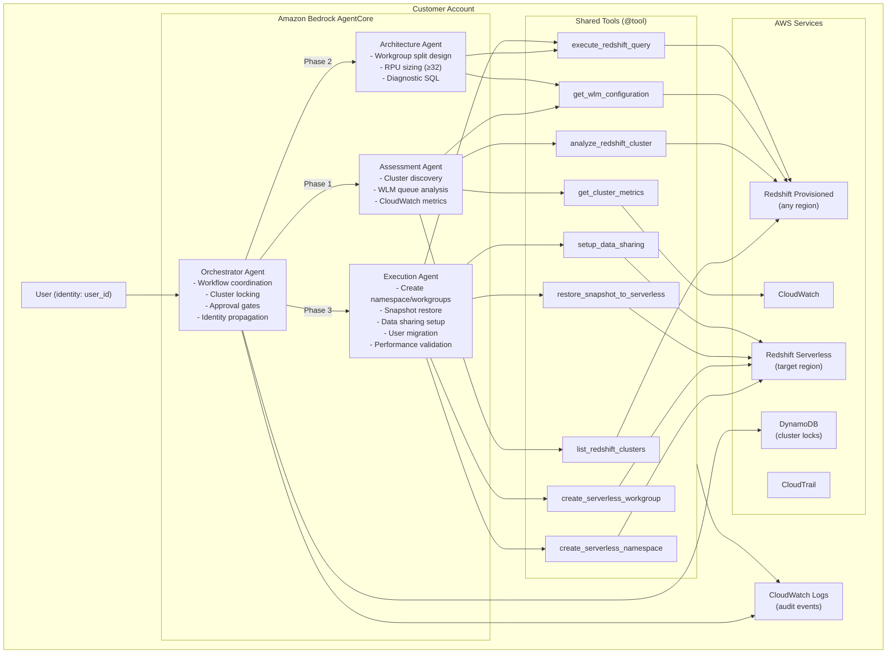
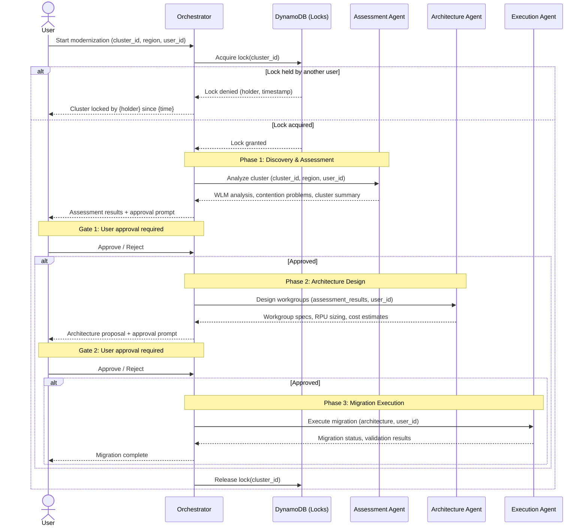

# Design: Redshift Modernization Agents

## Overview

This system is an AI-powered multi-agent application that guides customers through migrating a single AWS Redshift Provisioned cluster to a multi-warehouse Serverless architecture. It uses the Strands Agent framework with `@tool` decorators for autonomous multi-step reasoning, deployed to Amazon Bedrock AgentCore via `agentcore launch`.

The system consists of an orchestrator and three specialized subagents (assessment, architecture, execution) that run entirely within the customer's AWS account. The orchestrator drives a three-phase workflow with human-in-the-loop approval gates between each phase. A cluster-level locking mechanism prevents concurrent operations on the same cluster.

Key design changes from the previous iteration:
- Scoring agent removed; assessment now focuses on WLM queue analysis to surface contention problems
- Architecture agent proposes workgroup splits with RPU sizing (minimum 32 RPU for AI-driven scaling)
- Execution agent creates Serverless resources, restores snapshots, sets up data sharing, migrates users, validates performance
- Deployment via `agentcore launch` (no Docker/ATX SDK)
- Per-agent IAM roles scoped to least-privilege
- Cross-region support: agent deployed in one region can operate on clusters in any region
- End-to-end identity propagation from user through to Redshift audit logs and CloudTrail

## Architecture



### Workflow Sequence



## Components and Interfaces

### 1. Agent Framework Pattern

All agents use the Strands Agent framework with `BedrockAgentCoreApp` for deployment. Each agent is a Python module with:

```python
from strands import Agent
from strands.tools import tool
from strands_tools import http  # if needed

SYSTEM_PROMPT = """..."""

def create_agent(tools: list) -> Agent:
    return Agent(
        system_prompt=SYSTEM_PROMPT,
        tools=tools,
    )

# Deployment entry point
if __name__ == "__main__":
    from bedrock_agentcore.runtime import BedrockAgentCoreApp
    app = BedrockAgentCoreApp(agent_factory=create_agent)
    app.serve()
```

Deployment: `agentcore launch --name <agent-name> --entry <module>.py`

### 2. Orchestrator

Responsibilities:
- Coordinate the three-phase workflow (assessment → architecture → execution)
- Enforce human-in-the-loop approval gates between phases
- Acquire/release cluster-level locks via DynamoDB
- Propagate `user_id` to every subagent invocation and tool call
- Log every subagent delegation for workflow traceability

The orchestrator invokes subagents via Bedrock AgentCore's `InvokeAgent` API. Every invocation payload includes:
```python
{
    "message": "...",
    "cluster_id": "prod-cluster-01",
    "region": "us-east-2",
    "customer_account_id": "123456789012",
    "user_id": "jane.doe"
}
```

### 3. Assessment Agent

Tools: `list_redshift_clusters`, `analyze_redshift_cluster`, `get_cluster_metrics`, `get_wlm_configuration`

IAM role: read-only Redshift (`redshift:Describe*`, `redshift-data:ExecuteStatement` for system table reads) + CloudWatch read (`cloudwatch:GetMetricStatistics`)

Key behavior:
- If no cluster specified, list clusters and let user select
- Retrieve cluster config (node type, count, encryption, VPC, enhanced VPC routing)
- Retrieve CloudWatch metrics (CPU, connections, network, disk, latency)
- Query WLM configuration via `STV_WLM_SERVICE_CLASS_CONFIG`
- For each WLM queue: queries waiting, wait time vs execution time, disk spill amount, queue saturation
- Produce structured JSON with cluster summary, per-queue WLM metrics, and narrative of contention problems

Output schema:
```python
{
    "cluster_summary": { ... },
    "wlm_queue_analysis": [
        {
            "queue_name": str,
            "service_class": int,
            "concurrency": int,
            "queries_waiting": int,
            "avg_wait_time_ms": float,
            "avg_exec_time_ms": float,
            "wait_to_exec_ratio": float,
            "queries_spilling_to_disk": int,
            "disk_spill_mb": float,
            "saturation_pct": float,
        }
    ],
    "contention_narrative": str,
    "cloudwatch_metrics": { ... },
}
```

### 4. Architecture Agent

Tools: `get_wlm_configuration`, `execute_redshift_query` (read-only diagnostic SQL)

IAM role: read-only Redshift (`redshift:Describe*`, `redshift-data:ExecuteStatement` for diagnostic queries) + CloudWatch read

Key behavior:
- If multiple WLM queues exist, map each queue to its own Serverless workgroup
- If only one queue, interact with user to split into at minimum producer (ETL/write) and consumer (analytics/read) workgroups
- Run diagnostic SQL to determine starting RPU values per workgroup
- Minimum RPU recommendation: 32 (required for AI-driven scaling)
- Recommend AI-driven scaling with price-performance targets
- Support three patterns: hub-and-spoke with data sharing, independent warehouses, hybrid
- Include cost estimates and migration complexity

Output schema:
```python
{
    "architecture_pattern": "hub-and-spoke" | "independent" | "hybrid",
    "namespace": { "name": str, "admin_user": str },
    "workgroups": [
        {
            "name": str,
            "source_wlm_queue": str | None,
            "workload_type": "producer" | "consumer" | "mixed",
            "base_rpu": int,  # >= 32
            "max_rpu": int,
            "scaling_policy": "ai-driven",
            "price_performance_target": str,
        }
    ],
    "data_sharing": {
        "enabled": bool,
        "producer_workgroup": str,
        "consumer_workgroups": [str],
    },
    "cost_estimate": { "monthly_min": float, "monthly_max": float },
    "migration_complexity": "low" | "medium" | "high",
    "trade_offs": [str],
}
```

### 5. Execution Agent

Tools: `execute_redshift_query`, `create_serverless_namespace`, `create_serverless_workgroup`, `restore_snapshot_to_serverless`, `setup_data_sharing`

IAM role: Redshift write (`redshift-serverless:Create*`, `redshift-serverless:Update*`, `redshift:RestoreFromClusterSnapshot`, `redshift-data:ExecuteStatement`) + Redshift read + CloudWatch read

Key behavior:
- Create Serverless namespace and workgroups per architecture spec
- Restore latest snapshot of Provisioned cluster into the new namespace
- Set up data sharing between workgroups if hub-and-spoke
- Generate user/application migration plan (old WLM queues → new workgroups)
- Validate query performance on new workgroups (run representative queries, compare latency)
- Define rollback procedures at each step
- Plan minimal/zero downtime cutover

### 6. Shared Tools

All tools are defined in `tools/redshift_tools.py` using the Strands `@tool` decorator. Every tool:
- Accepts `region` as a parameter (cross-region support)
- Accepts `user_id` for identity propagation
- Emits structured audit events via `audit_logger.emit_audit_event()`
- Returns `Dict` or `List[Dict]`; errors include `"error"` key

Tool-to-Agent mapping:

| Tool | Assessment | Architecture | Execution |
|------|-----------|-------------|-----------|
| `list_redshift_clusters` | ✓ | — | — |
| `analyze_redshift_cluster` | ✓ | — | — |
| `get_cluster_metrics` | ✓ | — | — |
| `get_wlm_configuration` | ✓ | ✓ | — |
| `execute_redshift_query` | — | ✓ | ✓ |
| `create_serverless_namespace` | — | — | ✓ |
| `create_serverless_workgroup` | — | — | ✓ |
| `restore_snapshot_to_serverless` | — | — | ✓ |
| `setup_data_sharing` | — | — | ✓ |

### 7. Cluster Locking

A DynamoDB table `redshift_modernization_locks` provides cluster-level mutual exclusion:

```python
{
    "cluster_id": str,        # Partition key
    "lock_holder": str,       # user_id of lock holder
    "acquired_at": str,       # ISO 8601 timestamp
    "ttl": int,               # Auto-expire after 24h (epoch seconds)
}
```

Lock acquisition uses DynamoDB conditional writes (`attribute_not_exists(cluster_id)`) for atomicity. The orchestrator acquires the lock at workflow start and releases it on completion or failure (including in error handlers).

### 8. Audit Logger

`tools/audit_logger.py` emits structured JSON to a dedicated `redshift_modernization_audit` Python logger. Every event includes:

```python
{
    "timestamp": str,              # ISO 8601
    "event_type": str,             # agent_start | tool_invocation | workflow_start | workflow_complete | phase_start | phase_complete | error
    "agent_name": str,
    "customer_account_id": str,
    "initiated_by": str,           # user_id — identity propagation
    "cluster_id": str,
    "region": str,
    "details": dict,               # event-specific payload
}
```

### 9. Identity Propagation

```
User (jane.doe)
  → Orchestrator session (user_id="jane.doe")
    → Subagent payload (user_id="jane.doe")
      → Tool invocation (audit: initiated_by="jane.doe")
        → Redshift Data API (DbUser="jane.doe")
          → Redshift audit: STL_CONNECTION_LOG shows jane.doe
            → CloudTrail: PrincipalTag/user=jane.doe
```

Implementation:
1. Initial request to orchestrator includes `user_id`
2. Orchestrator propagates `user_id` in every subagent `inputPayload`
3. Every tool passes `user_id` to `emit_audit_event(initiated_by=user_id)`
4. SQL tools pass `DbUser=user_id` to Redshift Data API `ExecuteStatement`
5. Agent IAM role assumption uses session tags: `aws:PrincipalTag/user={user_id}`

### 10. Cross-Account Log Sharing (Opt-In)

During deployment/setup, the customer is prompted to opt-in to CloudWatch cross-account log sharing with the Redshift Service Team. If opted in, a CloudWatch Logs subscription filter forwards audit log events to a central Redshift Service Team log destination. CloudTrail captures underlying API calls regardless of opt-in.

## Data Models

### Assessment Output

```python
@dataclass
class WLMQueueMetrics:
    queue_name: str
    service_class: int
    concurrency: int
    queries_waiting: int
    avg_wait_time_ms: float
    avg_exec_time_ms: float
    wait_to_exec_ratio: float
    queries_spilling_to_disk: int
    disk_spill_mb: float
    saturation_pct: float

@dataclass
class ClusterSummary:
    cluster_id: str
    node_type: str
    number_of_nodes: int
    status: str
    region: str
    encrypted: bool
    vpc_id: str
    publicly_accessible: bool
    enhanced_vpc_routing: bool
    cluster_version: str

@dataclass
class AssessmentResult:
    cluster_summary: ClusterSummary
    wlm_queue_analysis: list[WLMQueueMetrics]
    contention_narrative: str
    cloudwatch_metrics: dict
```

### Architecture Output

```python
@dataclass
class WorkgroupSpec:
    name: str
    source_wlm_queue: str | None
    workload_type: str  # "producer" | "consumer" | "mixed"
    base_rpu: int       # >= 32
    max_rpu: int
    scaling_policy: str  # "ai-driven"
    price_performance_target: str

@dataclass
class DataSharingConfig:
    enabled: bool
    producer_workgroup: str
    consumer_workgroups: list[str]

@dataclass
class ArchitectureResult:
    architecture_pattern: str  # "hub-and-spoke" | "independent" | "hybrid"
    namespace_name: str
    workgroups: list[WorkgroupSpec]
    data_sharing: DataSharingConfig
    cost_estimate_monthly_min: float
    cost_estimate_monthly_max: float
    migration_complexity: str  # "low" | "medium" | "high"
    trade_offs: list[str]
```

### Execution State

```python
@dataclass
class MigrationStep:
    step_id: str
    description: str
    status: str  # "pending" | "in_progress" | "completed" | "failed" | "rolled_back"
    rollback_procedure: str
    validation_query: str | None

@dataclass
class ExecutionResult:
    namespace_created: bool
    workgroups_created: list[str]
    snapshot_restored: bool
    data_sharing_configured: bool
    user_migration_plan: list[dict]
    performance_validation: dict  # query → {provisioned_ms, serverless_ms, delta_pct}
    rollback_procedures: list[MigrationStep]
    cutover_plan: dict
```

### Cluster Lock

```python
@dataclass
class ClusterLock:
    cluster_id: str       # DynamoDB partition key
    lock_holder: str      # user_id
    acquired_at: str      # ISO 8601
    ttl: int              # epoch seconds, 24h from acquisition
```

### Audit Event

```python
@dataclass
class AuditEvent:
    timestamp: str              # ISO 8601
    event_type: str             # agent_start | tool_invocation | workflow_start | workflow_complete | phase_start | phase_complete | error
    agent_name: str
    customer_account_id: str
    initiated_by: str           # user_id
    cluster_id: str
    region: str
    details: dict
```


## Correctness Properties

*A property is a characteristic or behavior that should hold true across all valid executions of a system — essentially, a formal statement about what the system should do. Properties serve as the bridge between human-readable specifications and machine-verifiable correctness guarantees.*

### Property 1: Cluster listing returns all clusters in region

*For any* mocked set of Redshift clusters in a given region, calling `list_redshift_clusters(region)` should return a list whose length equals the number of clusters in the mock, and every cluster identifier from the mock should appear in the result.

**Validates: Requirements FR-2.1**

### Property 2: Cluster configuration output contains all required fields

*For any* Redshift cluster (mocked via `describe_clusters`), calling `analyze_redshift_cluster(cluster_id, region)` should return a dict containing all required keys: `cluster_identifier`, `node_type`, `number_of_nodes`, `cluster_status`, `cluster_version`, `encrypted`, `vpc_id`, `publicly_accessible`, `enhanced_vpc_routing`.

**Validates: Requirements FR-2.2**

### Property 3: CloudWatch metrics output contains all required metric categories

*For any* cluster with CloudWatch data, calling `get_cluster_metrics(cluster_id, region)` should return a dict whose `metrics` key contains entries for all required categories: `CPUUtilization`, `DatabaseConnections`, `NetworkReceiveThroughput`, `NetworkTransmitThroughput`, `PercentageDiskSpaceUsed`, `ReadLatency`, `WriteLatency`.

**Validates: Requirements FR-2.3**

### Property 4: WLM per-queue metrics are complete

*For any* WLM configuration with N queues (N ≥ 1), the assessment output's `wlm_queue_analysis` should contain exactly N entries, and each entry should include all required fields: `queue_name`, `service_class`, `concurrency`, `queries_waiting`, `avg_wait_time_ms`, `avg_exec_time_ms`, `wait_to_exec_ratio`, `queries_spilling_to_disk`, `disk_spill_mb`, `saturation_pct`.

**Validates: Requirements FR-2.4, FR-2.5**

### Property 5: Workgroup count matches WLM queue mapping rules

*For any* assessment result with N WLM queues where N > 1, the architecture output should contain at least N workgroups (one per queue). *For any* assessment result with exactly 1 WLM queue, the architecture output should contain at least 2 workgroups (producer + consumer).

**Validates: Requirements FR-3.1**

### Property 6: All workgroup RPUs are at least 32

*For any* architecture output, every workgroup's `base_rpu` must be ≥ 32.

**Validates: Requirements FR-3.3**

### Property 7: Architecture pattern is one of three valid values

*For any* architecture output, the `architecture_pattern` field must be one of: `"hub-and-spoke"`, `"independent"`, `"hybrid"`.

**Validates: Requirements FR-3.4**

### Property 8: Architecture output includes cost estimates and migration complexity

*For any* architecture output, the fields `cost_estimate_monthly_min`, `cost_estimate_monthly_max`, `migration_complexity`, `workgroups`, `data_sharing`, and `trade_offs` must all be present and non-null. `migration_complexity` must be one of `"low"`, `"medium"`, `"high"`.

**Validates: Requirements FR-3.5, FR-3.6**

### Property 9: Execution workgroup RPUs match architecture spec

*For any* architecture result with workgroup specs, the execution agent's `create_serverless_workgroup` calls should use `base_rpu` and `max_rpu` values that exactly match the corresponding workgroup spec from the architecture output.

**Validates: Requirements FR-4.1**

### Property 10: Data sharing configured if and only if hub-and-spoke

*For any* architecture result, if `architecture_pattern` is `"hub-and-spoke"` then `data_sharing.enabled` must be `True` and `setup_data_sharing` must be invoked during execution. If the pattern is `"independent"` or `"hybrid"` without data sharing, then `data_sharing.enabled` must be `False`.

**Validates: Requirements FR-4.3**

### Property 11: Migration plan covers all source WLM queues

*For any* architecture result with workgroups that have `source_wlm_queue` mappings, the execution agent's user migration plan must include an entry for every unique `source_wlm_queue` value, mapping it to the corresponding target workgroup.

**Validates: Requirements FR-4.4**

### Property 12: Every execution step has a rollback procedure

*For any* execution plan, every `MigrationStep` must have a non-empty `rollback_procedure` string.

**Validates: Requirements FR-4.6**

### Property 13: Identity propagation consistency

*For any* tool invocation with a `user_id` parameter, the emitted audit event's `initiated_by` field must equal `user_id`, and any `execute_redshift_query` call must pass `DbUser=user_id` to the Redshift Data API.

**Validates: Requirements FR-5.3, NFR-7.1, NFR-7.3**

### Property 14: Audit event schema validity

*For any* audit event emitted by `emit_audit_event`, the event must contain all required fields (`timestamp`, `event_type`, `agent_name`, `customer_account_id`, `initiated_by`, `cluster_id`, `region`), the `timestamp` must be valid ISO 8601, and `event_type` must be one of: `agent_start`, `tool_invocation`, `workflow_start`, `workflow_complete`, `phase_start`, `phase_complete`, `error`.

**Validates: Requirements FR-5.4, NFR-6.2, NFR-6.6, NFR-7.2**

### Property 15: Orchestrator does not advance phase without approval

*For any* workflow state machine, the orchestrator must not transition from phase N to phase N+1 without an intervening approval event. Specifically: assessment → architecture requires Gate 1 approval, and architecture → execution requires Gate 2 approval.

**Validates: Requirements FR-6.2, FR-6.4, FR-6.6**

### Property 16: Cluster lock mutual exclusion

*For any* two concurrent lock acquisition attempts on the same `cluster_id`, exactly one must succeed and the other must fail. The successful acquisition must store the `lock_holder` and `acquired_at` values.

**Validates: Requirements NFR-2.2**

### Property 17: Lock denial includes holder identity and timestamp

*For any* failed lock acquisition attempt (because the cluster is already locked), the error response must include the current lock holder's `lock_holder` (user_id) and `acquired_at` (ISO 8601 timestamp).

**Validates: Requirements NFR-2.3**

### Property 18: Tools pass region parameter to boto3 client

*For any* tool invocation with a `region` parameter, the boto3 client must be created with `region_name` equal to the specified region, not a hardcoded default.

**Validates: Requirements NFR-3.3**

### Property 19: Orchestrator logs every subagent delegation

*For any* subagent invocation by the orchestrator, an audit event must be emitted with `event_type` containing the subagent name, the input payload, and the result summary.

**Validates: Requirements FR-5.5**

## Error Handling

### Tool-Level Errors

All tools follow a consistent error pattern:
- Catch exceptions from boto3 calls
- Return a dict with `"error"` key containing the error message, plus the input parameters (`cluster_id`, `region`) for context
- Never raise exceptions to the agent framework — always return structured error responses
- The agent's reasoning loop decides how to handle the error (retry, inform user, try alternative)

```python
@tool
def some_tool(cluster_id: str, region: str = "us-east-2") -> Dict:
    try:
        # boto3 call
        return { "result": ... }
    except ClientError as e:
        return { "error": str(e), "cluster_id": cluster_id, "region": region }
    except Exception as e:
        return { "error": f"Unexpected: {str(e)}", "cluster_id": cluster_id, "region": region }
```

### Cluster Lock Errors

- Lock acquisition failure: return lock holder identity and acquisition time so the orchestrator can inform the user
- Lock release failure: log error but don't block workflow completion (TTL provides safety net)
- DynamoDB unavailable: fail the workflow start with a clear error message

### Workflow Phase Errors

- If a subagent invocation fails, the orchestrator presents the error to the user and offers to retry
- If a phase fails after partial execution (e.g., namespace created but workgroup creation failed), the execution agent's rollback procedures are invoked
- The orchestrator never silently swallows errors — every error is surfaced to the user

### Identity Propagation Errors

- If `user_id` is missing from the initial request, the orchestrator rejects the request with a clear error
- If `user_id` cannot be propagated to a subagent, the orchestrator logs an error audit event and halts

### Audit Logger Errors

- Audit logging failures must never block the main workflow
- If `emit_audit_event` fails (e.g., logger misconfigured), the error is caught and logged to stderr
- The audit logger uses best-effort account ID resolution: environment variable first, STS fallback, "unknown" as last resort

## Testing Strategy

### Unit Tests

Unit tests use `pytest` with `unittest.mock.patch` on `boto3.client` to mock all AWS API calls. No AWS credentials are required.

Focus areas for unit tests:
- Tool functions: verify correct boto3 calls, response parsing, error handling
- Audit logger: verify event schema, field presence, ISO 8601 timestamps
- Cluster lock: verify DynamoDB conditional write logic, lock/unlock lifecycle
- Assessment output: verify WLM queue parsing and metric aggregation
- Architecture output: verify workgroup mapping logic and RPU constraints
- Execution plan: verify rollback procedure generation

Edge cases to cover:
- Empty cluster list (no clusters in region)
- Cluster with no WLM queues configured
- Single WLM queue (triggers producer/consumer split)
- CloudWatch metrics with no datapoints
- DynamoDB conditional check failure (lock contention)
- Missing `user_id` in request
- Invalid region parameter
- boto3 `ClientError` responses

### Property-Based Tests

Property-based tests use the `hypothesis` library (Python) with a minimum of 100 examples per property. Each test references its design document property via a comment tag.

Configuration:
```python
from hypothesis import given, settings, strategies as st

@settings(max_examples=100)
@given(...)
def test_property_name(...):
    # Feature: redshift-modernization-agents, Property N: <property text>
    ...
```

Each correctness property (Properties 1–19) maps to a single `hypothesis` test function. Generators produce random:
- Cluster configurations (node types, counts, encryption settings, VPC IDs)
- WLM queue configurations (varying queue counts, concurrency levels, wait times, spill amounts)
- Architecture patterns and workgroup specs
- User IDs and region strings
- Audit event parameters

Tag format for each test: `Feature: redshift-modernization-agents, Property {N}: {property_title}`

### Test Dependencies

Tests require packages listed in `tests/requirements-test.txt`:
```
pytest
pytest-cov
pytest-mock
hypothesis
```

### Running Tests

```bash
cd src/redshift_agents
pytest tests/ -v
```
